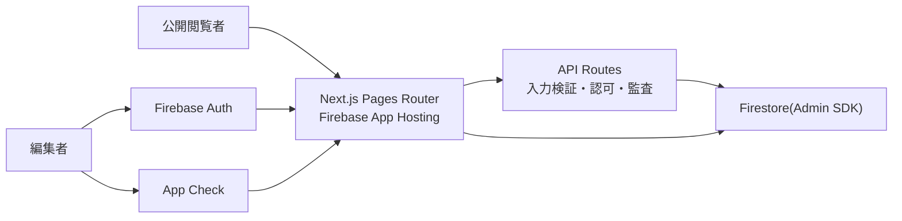

# Firebase App Hosting で公開しつつ、XSS を極小化する推奨構成

## 結論

今回の要件なら、`Firebase App Hosting + Next.js Pages Router + Firebase Auth + Firestore + server-only write` が最も扱いやすく、XSS の事故も起こしにくいです。

`App Router` は React Server Components 系の脆弱性影響を受けやすかった時期があるため、樹形図ビューアと編集画面のような用途では、あえて `Pages Router` を選ぶ方が安全側です。

## なぜこの構成にするか

1. `Firebase App Hosting` は Firebase 公式で `Next.js` を事前サポートしています。
2. 公開ページと編集 API を同じアプリで持てます。
3. Firestore へブラウザから直接書かせない構成にすると、権限制御と入力検証をサーバー側に集中できます。
4. 樹形図データを `HTML` ではなく `構造化 JSON` として持てば、XSS の主因である「ユーザー入力を HTML として描画する」経路を消せます。

## 推奨アーキテクチャ



## 役割分担

- 公開ページ
  - `published` 済みの樹形図だけ読む
  - 画面は React の通常テキスト描画だけで構成する
  - `dangerouslySetInnerHTML` は使わない
- 編集画面
  - `/admin` 以下に分離する
  - Firebase Auth で認証し、編集者だけ入れるようにする
  - 保存は必ず `API Routes` 経由にする
- Firestore
  - ブラウザ SDK から直接 read/write しない
  - Next.js サーバーから `Admin SDK` で読む
  - これに合わせて Firestore Rules は原則 `deny all` にする

## データモデル

### 基本方針

`HTML` や `Markdown を HTML に変換したもの` は保存しません。保存するのはあくまで `plain text + enum + number + boolean + child id list` だけです。

推奨スキーマは以下です。

```json
{
  "treeId": "marubou-kyousei-001",
  "title": "丸棒矯正 なぜなぜ問答",
  "status": "draft",
  "version": 7,
  "rootId": "n-root",
  "nodes": [
    {
      "id": "n-root",
      "type": "problem",
      "title": "矯正後の丸棒で真直度NGが発生した",
      "note": "発生日: 2026-03-09",
      "tags": ["品質", "丸棒矯正"],
      "children": ["n-101", "n-201"]
    },
    {
      "id": "n-101",
      "type": "why",
      "title": "入側の曲がり状態を正しく把握できていなかった",
      "note": "目視依存",
      "tags": ["測定", "方法"],
      "children": []
    }
  ]
}
```

## 保存設計

最初は 1 ツリー = 1 ドキュメントのスナップショット保存で十分です。

- `trees/{treeId}`
  - タイトル
  - 現在の公開版番号
  - 現在の下書き版番号
- `trees/{treeId}/versions/{versionId}`
  - `status`: `draft` or `published`
  - `tree`: 樹形図 JSON 全体
  - `updatedBy`
  - `updatedAt`

この形だと公開時に `draft` を丸ごと `published` として固定できるので、公開版の内容があとから崩れません。

## 編集フロー

1. 編集者が `/admin/trees/:id` に入る
2. Firebase Auth でログインする
3. クライアントは Firebase ID token と App Check token を取得する
4. 保存時は `/api/editor/trees/:id` に送る
5. API Route で以下を実施する
   - ID token を検証
   - 編集権限を検証
   - App Check token を検証
   - JSON schema を検証
   - 文字数、ノード数、深さ上限を検証
   - 保存前に normalize する
6. Firestore へ Admin SDK で保存する
7. 公開時は `/api/editor/trees/:id/publish` で `draft` を `published` として複製する

## XSS をほぼ起こさないための原則

### 1. ユーザー入力を HTML として扱わない

これが一番効きます。`title` `note` `tag` は全部プレーンテキストとして保持し、React の通常描画に任せます。

```tsx
<p>{node.note}</p>
```

これなら React 側で文字列として扱われるため、`<script>` を入力されても実行されません。

### 2. `dangerouslySetInnerHTML` を禁止する

React 公式でも、`dangerouslySetInnerHTML` は XSS を導入しやすいので極めて慎重に扱うべきとされています。今回の用途では使わない方がよいです。

### 3. Markdown プレビューも最初は入れない

Markdown を許すと、最終的に「HTML へ変換して描画」が入りやすくなります。最初は `plain text only` に固定する方が安全です。

改行が欲しければ、保存時にそのまま改行文字を持ち、描画は CSS で対応します。

```css
.note {
  white-space: pre-wrap;
}
```

### 4. 入力値はサーバー側で allowlist 検証する

少なくとも以下を API 側で検証します。

- `type` は固定 enum のみ
- `title` は最大 120 文字
- `note` は最大 2000 文字
- `tags` は最大 10 個
- `children` は既存 `id` のみ
- 循環参照禁止
- 木の深さ上限あり
- ノード総数上限あり

必要なら、業務上不要であれば `<` `>` を reject しても構いません。React が escape するので必須ではありませんが、防御をもう一段固くできます。

### 5. 公開版と編集版を分ける

公開ページは必ず `published` 版だけを読むようにします。編集中データをそのまま一般公開ページに載せないことが重要です。

### 6. CSP を入れる

少なくとも以下は入れます。

```txt
default-src 'self';
base-uri 'self';
object-src 'none';
frame-ancestors 'none';
form-action 'self';
```

さらに、認証や API 通信に必要な最小限の `connect-src` だけを追加します。もし inline script を避けられない場合は、Next.js 公式ガイドどおり nonce ベースの CSP にします。

## 認証・認可

### 認証

- Firebase Auth を使う
- 社内運用なら Google Workspace ログインを優先する
- 編集者はメール確認済みアカウントだけに限定する
- 管理画面は Firebase ID token をそのまま長く持たず、ログイン直後に `httpOnly` な session cookie へ交換する

### セッション管理

管理画面で `localStorage` や長寿命の client-side token に依存すると、万一 XSS が入ったときに token を抜かれやすくなります。Firebase 公式の session cookie 方式へ寄せる方が安全です。

推奨フローは以下です。

1. ログイン画面で Firebase Auth により一度だけ sign-in する
2. 直後に ID token を `/api/session/login` へ送る
3. サーバーが Firebase Admin SDK で session cookie を発行する
4. `httpOnly`, `Secure`, `SameSite=Strict` の cookie をセットする
5. クライアント側の Firebase Auth persistence は `NONE` にし、ID token をブラウザへ残さない
6. `/admin` 配下は session cookie 検証後だけ表示する

### 認可

- `editor: true` の custom claim を付与する
- API 側で ID token を検証し、claim を確認する
- Firestore Rules に編集権限を持たせるのではなく、Firestore 自体を server-only に寄せる

## App Check の使い方

App Check は XSS 対策そのものではありませんが、編集 API への濫用アクセスを減らすのに有効です。

- 編集画面から API を叩くときだけ App Check token を添付する
- API 側で App Check token を検証する
- Web は `reCAPTCHA Enterprise` を優先する

ただし、App Check があっても「自分のオリジン上で XSS が成立したあと」の被害は止められません。App Check は補助線であり、主防御はあくまで `plain text only`, `server-side validation`, `no innerHTML`, `CSP`, `httpOnly session cookie` です。

## ルーティング案

- `/`
  - 公開トップ
- `/trees/[treeId]`
  - 公開樹形図ビューア
- `/admin/login`
  - ログイン
- `/admin/trees/[treeId]`
  - 編集画面
- `/api/editor/trees/[treeId]`
  - 下書き取得、保存
- `/api/editor/trees/[treeId]/publish`
  - 公開操作

## 実装上の注意

### 樹形図表示

見やすさ優先なら、公開画面は次の制約を入れた方がよいです。

- 初期表示は全展開しない
- 1 つの枝だけ展開する `focus mode` を付ける
- 現在選択ノードまでの breadcrumb を出す
- 深さが深いときは兄弟枝を折りたたむ
- ノード内は `title`, `note`, `tags` だけに絞る

### 検索ハイライト

検索語を `innerHTML` で埋め込まないこと。文字列分割して `<mark>` ノードを組み立てれば、ハイライトも XSS を増やさず実装できます。

## 将来やらない方がいいこと

- 生 HTML の保存
- WYSIWYG エディタの早期導入
- SVG をユーザー入力としてそのまま埋め込むこと
- Firestore へブラウザから直接 write すること
- 公開ページで `draft` を直接読むこと

## もしさらに安全側に倒すなら

次の順で効きます。

1. `App Router` ではなく `Pages Router` を使う
2. Firestore は client SDK を使わず、完全に server-only にする
3. `plain text only` を守る
4. `published snapshot` 制を入れる
5. CSP と App Check を入れる

## 推奨初期スコープ

最初の 1 版はこれで十分です。

- 公開ビューア
- 編集者専用ログイン
- ノードの追加、削除、並び替え
- 下書き保存
- 公開ボタン
- 版管理

リッチテキスト、添付ファイル、共同編集は後回しが安全です。

## 参考にした公式情報

- Firebase App Hosting は 2025-12-18 更新の公式ドキュメントで `Next.js` と `Angular` を事前サポートしています: [Firebase App Hosting](https://firebase.google.com/docs/app-hosting)
- App Hosting のフレームワーク資料では、2026-03-09 時点で `Next.js 15.2.x` が active、Node.js は `20+` が前提です: [Frameworks and tooling for App Hosting](https://firebase.google.com/docs/app-hosting/frameworks-tooling)
- Next.js 公式は CSP と nonce の利用を案内しています: [Next.js CSP guide](https://nextjs.org/docs/app/guides/content-security-policy)
- Firebase Auth 公式は、`httpOnly` な server-side session cookie 方式を案内しており、client-side persistence を `NONE` にする例も示しています: [Manage session cookies](https://firebase.google.com/docs/auth/admin/manage-cookies)
- Firebase 公式は custom claims を access control に使い、バックエンドでは ID token を検証すべきとしています: [Custom claims](https://firebase.google.com/docs/auth/admin/custom-claims)
- Firebase 公式は Firestore を server-only backend として使う場合、Rules を閉じる構成を案内しています: [Fix insecure rules](https://firebase.google.com/docs/firestore/security/insecure-rules)
- Firebase 公式は App Check を custom backend の保護にも使えるとしています: [Protect custom backend resources with App Check](https://firebase.google.com/docs/app-check/web/custom-resource)
- React 公式は `dangerouslySetInnerHTML` が trivially XSS を導入し得ると明示しています: [React common components](https://react.dev/reference/react-dom/components/common)
- Next.js は 2025-12-11 のセキュリティ更新で、`App Router` 系に影響する脆弱性修正を案内しており、`Pages Router` アプリは影響対象外としています: [Next.js security update 2025-12-11](https://nextjs.org/blog/security-update-2025-12-11)

## 補足

上の判断で「Pages Router を推奨」としているのは、公式資料から読み取れる最近の脆弱性傾向を踏まえた安全側の設計判断です。将来 `App Router` を使う場合でも、少なくとも最新の修正版へ継続追従する前提が必要です。
